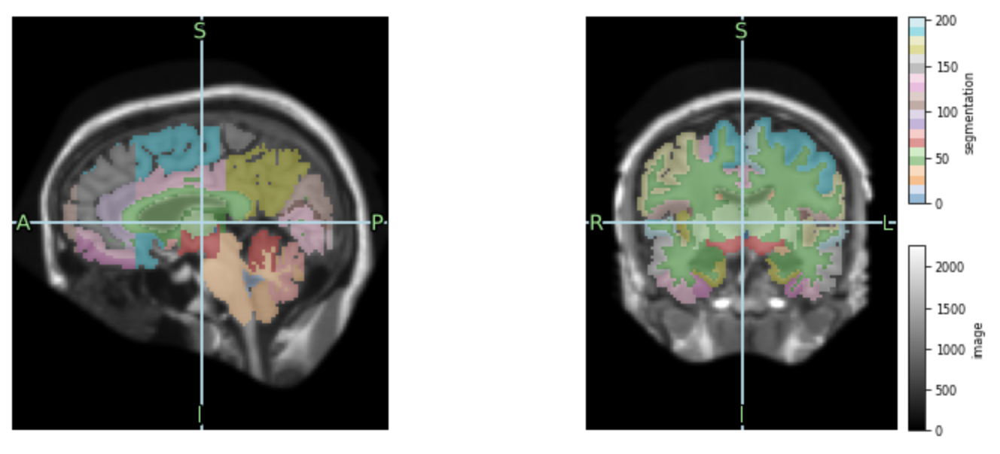

# Penn BE 5370 Python Utilities Package

This is a package of utilities to help complete homework assignments in the course BE5370 "Biomedical Image Analysis" offered at the University of Pennsylvania. 

To install this package, run

``` sh
pip install git+https://github.com/pyushkevich/upenn_be5370_utils.git
```

To use this package, add the following to your iPython notebook:

``` python 
from upenn_be5370_utils import *
```

The most useful routine here is `view_sitk`, a viewer for SimpleITK 3D medical images that emulates very basic ITK-SNAP image display. It currently can show coronal and sagittal planes from a 3D image at a given cursor location, and supports layering of overlays and segmentations over the main image. The basic usage is like this:

``` python 
import SimpleITK as sitk
from upenn_be5370_utils.sitkview import view_sitk

# Pick an atlas and load the image and the segmentation
img = sitk.ReadImage('mri.nii.gz')
seg = sitk.ReadImage('segmentation.nii.gz')

# Show the image and the segmentation
view_sitk([img, seg], cmap=['gray','tab20'], name=['image', 'segmentation'], width=10);
```

Resulting in the output below. Note that the code reads the image header and correctly assigns the anatomical direction labels. 


